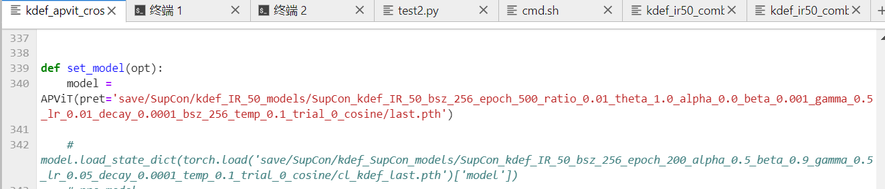

# GD_FER

* dataset:手动下载数据集xx.zip后解压，利用build_xxx.py构造dataloader保存为pkl，训练时读取；


* weights：已知的APViT和IResnet的预训练权重


* save：各种配置训练结束时保存的模型


# 运行命令

## 构建数据集:

* build_ddcf.py从DDCF文件夹构建对应的dataloader，
* build_pkldata从KEDF，build_rafd从RAFDB数据集

## 训练：

* 运行dataset_model_method.py，后加对应的超参parser
* 如数据集=kdef，模型=IResnet50，方法=L~viewFX~结合L~交叉熵~，batch_size=256，...

```py
python kdef_ir50_comb.py --ratio 0.0  --batch_size 256 --gamma 0.5 --beta 0.001 --learning_rate 0.01 --weight_decay 5e-4 --temp 0.07 --cosine
```

## 利用保存的模型测试：

* 如利用训练好的 APViT在DDCF数据集上测试，并保存losses，accus和混淆矩阵

```py
python test2.py  --model APViT  --dataset ddcf  --method  SupCon	--special Contrast
```

PS：双阶段训练，第二个阶段加载预训练模型时要在set_model函数中手动更改第一阶段训练好的模型路径，


