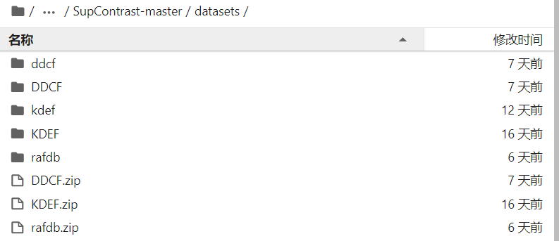
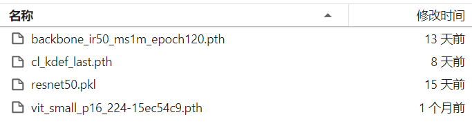
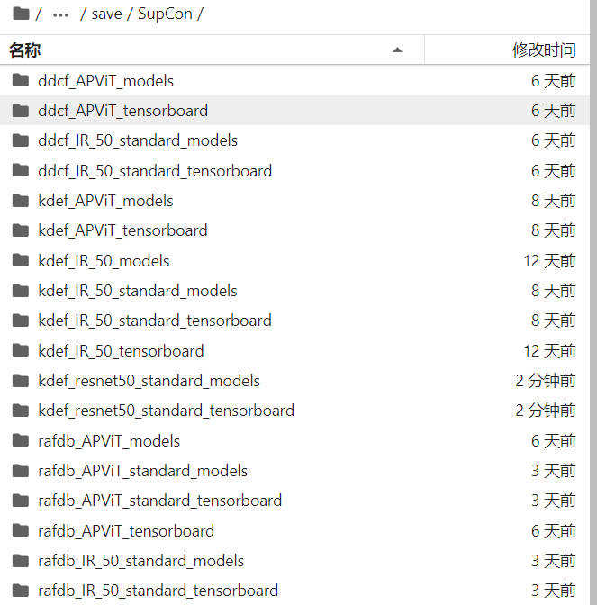

# GD_FER

* dataset:手动下载数据集xx.zip后解压，利用build_xxx.py构造dataloader保存为pkl，训练时读取；

* weights：已知的APViT和IResnet的预训练权重

* save：各种配置训练结束时保存的模型

=======
# GD_FER
>>>>>>> 39a69a8f467579d269ee2489a71ff8eceafb75e1
=======
# GD_FER
>>>>>>> 39a69a8f467579d269ee2489a71ff8eceafb75e1
